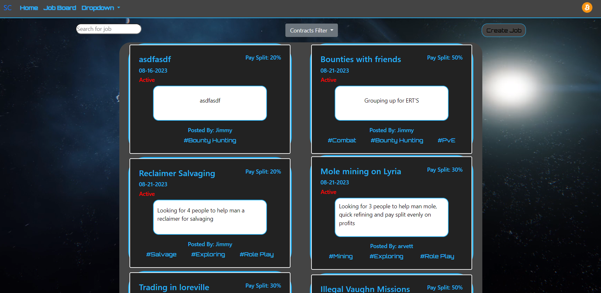
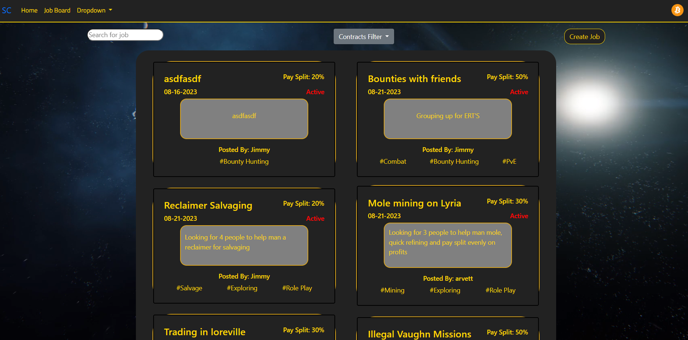
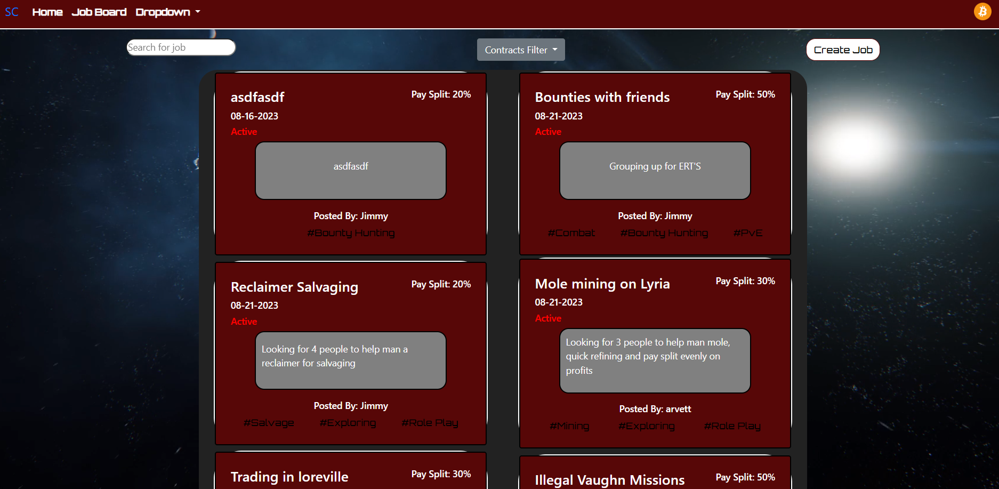
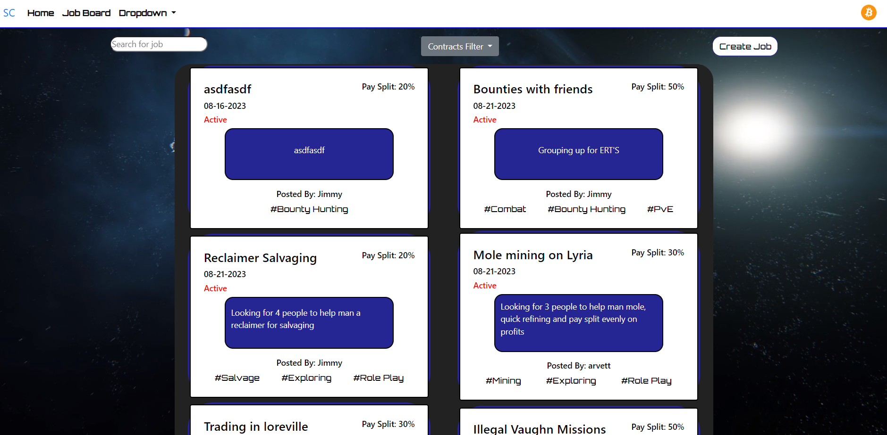

# Star Contractor

## What is this?
- This a web application designed to pair the fans and players of star citizen together by allowing players to post and give jobs or "contracts" to other players.

- This is being built by two fans of the game for learning purposes which hopefully helps the community as well as helps us further our Java skills.

- The site is not live anywhere yet, the deployment environment and hosting service has yet to be determined. We will provide a link to the live site once it has been deployed

## Usage
- On this site you can create an account, post or apply to jobs, add friends and connect with other plays in the verse!

- Ensure once a job has been completed for another user you rate them, this helps keep our users honest and let people know the credibility of job posters. 

- Choose your starting area in the game to have a unique experience on the page

#### <u>New Babbage</u>

#### <u>Lorville</u>

#### <u>Area 18</u>

#### <u>Orison</u>

## Features
- Friend system
- User rating system
- Job posting board
- Messaging system
- Unique styling for every starting area
- Filters and searching capabilities for jobs and categories

## Credits
- Austin Joiner
- Tyler Poepping(SSPENELOPE)